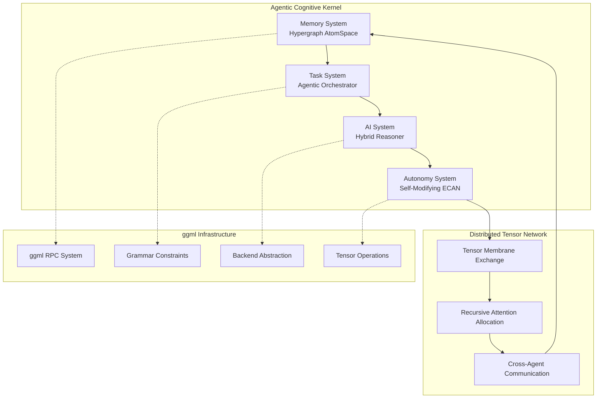

# Distributed Cognitive Architecture for ggml-org-central

This project transforms the ggml-org-central repository into a distributed network of agentic cognitive grammar, implementing a self-aware cognitive flow that serves as both a technical architecture and a living diagram of emergent intelligence.

## Table of Contents

- [Overview](#overview)
- [Quick Start](#quick-start)
  - [Prerequisites](#prerequisites)
  - [Building](#building)
  - [Available Demos](#available-demos)
- [Architecture Components](#architecture-components)
- [Key Features](#key-features)
- [Documentation](#documentation)
- [Demo Applications](#demo-applications)
- [Cognitive Grammar Examples](#cognitive-grammar-examples)
- [Integration with Existing ggml Components](#integration-with-existing-ggml-components)
- [Technical Architecture](#technical-architecture)
- [Performance Metrics](#performance-metrics)
- [Future Development](#future-development)
- [Contributing](#contributing)
- [Research Applications](#research-applications)
- [License](#license)

## Overview

The distributed cognitive system represents a paradigm shift from traditional tensor computation to an ecosystem of autonomous agents, each operating as a kernel of cognitive grammar. These agents exchange tensor-shaped data structures to realize emergent intelligence through recursive coordination.

## Quick Start

### Prerequisites

- CMake 3.14+
- C/C++ compiler with C99 support
- Math library support
- OpenMP (optional, for parallel processing)

### Building

```bash
# Clone the repository (if not already done)
git clone https://github.com/HyperCogWizard/flow-ml-org.git
cd flow-ml-org

# Build the main project
cd ggml
mkdir build && cd build
cmake ..
make -j$(nproc)

# Run the cognitive agents demo
./bin/cognitive-agents-demo
```

### Available Demos

After building, you can run several demonstrations:

```bash
# Cognitive agents network demo
./bin/cognitive-agents-demo

# Cognitive tensor operations demo
./bin/cognitive-tensor-demo

# Distributed cognitive integration demo
./bin/distributed-cognitive-demo

# Phase 3 Self-Modification demo (NEW!)
./bin/test-phase3-self-modification
```

## Architecture Components

### 🧠 Core Subsystems

1. **Memory System**: Distributed Hypergraph AtomSpace (Tensorized)
   - Hypergraph knowledge representation using ggml tensors
   - Distributed storage across multiple backends
   - Semantic indexing and retrieval

2. **Task System**: Agentic Task Orchestrator (Recursive, Symbolic+Neural)
   - Grammar-constrained task decomposition
   - Recursive execution planning
   - Integration with GBNF grammars

3. **AI System**: Hybrid Reasoning Engine (PLN + MOSES + Pattern Matcher)
   - Probabilistic Logic Networks for belief reasoning
   - Meta-Optimizing Semantic Evolution
   - Pattern matching via tensor operations

4. **Autonomy System**: Self-Modifying ECAN Attention Economy
   - Economic attention allocation
   - Performance-based resource management
   - Recursive self-improvement

### 🌐 Distributed Communication

The system leverages and extends the existing ggml RPC infrastructure:

- **Tensor Membrane Exchange**: Cognitive states as serialized tensor packets
- **Attention Routing**: Messages routed based on salience and relevance
- **Meta-Cognitive Headers**: Enhanced RPC with cognitive metadata

## Key Features

### 🔄 Recursive Intelligence
- Agents model other agents' cognitive states
- Meta-reasoning about reasoning processes
- Self-improvement through recursive optimization

### 🏗️ Emergent Architecture
- Spontaneous role specialization
- Adaptive communication patterns
- Hierarchical structures from flat networks

### 💡 Cognitive Grammar
- GBNF-based reasoning constraints
- Grammar-guided task decomposition
- Structured cognitive operations

## Documentation

### Core Documentation

- **[Distributed Cognitive Architecture](docs/distributed-cognitive-architecture.md)** - Complete architectural overview with system design, subsystem mapping, and implementation pathways
- **[Implementation Guide](docs/implementation-guide.md)** - Practical development guide with code examples, build instructions, and testing procedures
- **[Cognitive Grammar Examples](docs/cognitive-grammar-examples.md)** - Grammar system usage with GBNF integration and practical examples

### Component Documentation

- **[ggml README](ggml/README.md)** - Core tensor computation library documentation
- **[llama.cpp README](llama.cpp/README.md)** - Language model inference and grammar system
- **[whisper.cpp README](whisper.cpp/README.md)** - Audio processing and speech recognition
- **[Contributing Guidelines](llama.cpp/CONTRIBUTING.md)** - Development guidelines and coding standards

### Getting Started

1. Start with the [Quick Start](#quick-start) section above
2. Read the [Distributed Cognitive Architecture](docs/distributed-cognitive-architecture.md) for system understanding
3. Follow the [Implementation Guide](docs/implementation-guide.md) for development
4. Explore [Cognitive Grammar Examples](docs/cognitive-grammar-examples.md) for practical usage

## Demo Applications

### Cognitive Agents Network Demo

The primary demonstration showcases the distributed cognitive architecture in action:

```bash
# Run from the ggml/build directory
./bin/cognitive-agents-demo
```

This comprehensive demo includes three main scenarios:

#### 1. Consciousness Exploration
- **Philosopher Agent**: Specializes in consciousness concepts and philosophical reasoning
- **Scientist Agent**: Focuses on neuroscience perspective and empirical analysis
- **Collaborative Reasoning**: Demonstrates cross-agent knowledge exchange and belief integration
- **Attention Management**: Shows dynamic resource allocation based on cognitive load

#### 2. Distributed Problem Solving
- **Coordinator Agent**: Decomposes complex problems into manageable subtasks
- **Analyzer Agent**: Performs detailed pattern analysis and data processing
- **Synthesizer Agent**: Integrates results from multiple sources into coherent solutions
- **Network Communication**: Demonstrates tensor-based message passing between agents

#### 3. Attention Economy Management
- **Resource Allocation**: Dynamic attention distribution across cognitive functions
- **Performance Monitoring**: Real-time tracking of cognitive efficiency metrics
- **Adaptation Mechanisms**: Automatic adjustment of attention based on task demands
- **Economic Optimization**: Utility-based resource management with scarcity constraints

### Cognitive Tensor Operations Demo

```bash
# Run from the ggml/build directory
./bin/cognitive-tensor-demo
```

This demo showcases the neural-symbolic tensor architecture:

- **Prime-Offset Matula-Goebel Mappings**: Tree structure encoding using prime factorization
- **Quantum Phase Encoding**: Complex-valued tensor operations with quantum-inspired states
- **Hypergraph Composition**: Tensor operations representing knowledge graph relationships
- **Attention Mechanisms**: Prime-structured attention patterns for cognitive focus

### Additional Demos

```bash
# Distributed cognitive integration
./bin/distributed-cognitive-demo

# Cognitive tensor testing
./bin/test-cognitive-tensor
```

### Example Output

The consciousness exploration demo produces output similar to:

```
=== Consciousness Exploration Demo ===
Created cognitive agent 1751543536001 at localhost:8001
Created cognitive agent 1751543536002 at localhost:8002

Adding knowledge to agents...
Added knowledge: consciousness (nodes: 1)
Added knowledge: philosophy_of_mind (nodes: 2)
Added knowledge: neuroscience (nodes: 1)

Simulating consciousness exploration...
Allocated 0.60 attention to type 3 (total: 0.60/1.00)
Agent 1751543536001 sent cognitive tensor (type 1, attention 0.80, salience 0.56)
Agent 1751543536002 received cognitive tensor from agent 1751543536001
  Processing reasoning request

Cognitive state updates:
Philosopher - Inferences made: 0
Scientist - Inferences made: 1
Philosopher found consciousness concept with truth value: 0.80
Scientist found neuroscience concept with truth value: 0.80
```

### Performance Characteristics

The demos are designed to demonstrate:

- **Scalability**: Multiple agents can operate simultaneously without interference
- **Efficiency**: Attention economy prevents resource waste through intelligent allocation
- **Adaptability**: Agents adjust their behavior based on network conditions and task requirements
- **Robustness**: System continues operating even when individual agents experience issues

## Cognitive Grammar Examples

### Task Decomposition
```gbnf
task(solve_consciousness_question)
preconditions(
    knowledge(consciousness, embedding_1),
    tensor_similarity(tensor_1, tensor_2, 0.7)
)
decomposition(
    task(gather_definitions),
    task(analyze_perspectives),
    task(synthesize_answer)
)
postconditions(
    belief(consciousness_understood, 0.8, 0.7)
)
```

### Reasoning Patterns
```gbnf
deduction(
    premise1(belief(humans_conscious, 0.9, 0.95)),
    premise2(relation(consciousness, requires, self_awareness, 0.8)),
    conclusion(belief(humans_self_aware, 0.8, 0.9)),
    strength(0.85)
)
```

### Attention Allocation
```gbnf
allocate(
    amount(0.4),
    target(memory),
    priority(high),
    duration(5000ms)
)
```

## Integration with Existing ggml Components

### Enhanced RPC System
The cognitive framework extends ggml-rpc with:
- Cognitive tensor packets with attention metadata
- Salience-based message routing
- Performance monitoring and feedback

### Grammar System
Leverages llama.cpp's GBNF system for:
- Cognitive grammar validation
- Constrained reasoning generation
- Task decomposition rules

### Backend Abstraction
Utilizes ggml's backend system for:
- Distributed cognitive computation
- Specialized reasoning backends
- Economic resource allocation

## Technical Architecture



## Performance Metrics

The system tracks various cognitive performance indicators:

- **Attention Economy Efficiency**: Resource allocation optimality
- **Cognitive Throughput**: Operations per second across network
- **Adaptation Speed**: Time to adjust to new conditions
- **Memory Efficiency**: Hypergraph storage optimization
- **Communication Overhead**: Network utilization analysis

## Future Development

### Phase 1: Foundation (Current)
- ✅ Basic cognitive agent framework
- ✅ Attention economy implementation
- ✅ Hypergraph memory system
- ✅ Grammar-based task decomposition

### Phase 2: Advanced Reasoning (COMPLETE ✅)
- [x] PLN reasoning engine integration
- [x] MOSES optimization system
- [x] Advanced pattern matching
- [x] Real distributed communication

### Phase 3: Self-Modification (COMPLETE ✅)
- [x] Recursive self-improvement
- [x] Automated architecture evolution
- [x] Meta-meta-reasoning capabilities
- [x] Emergent behavior analysis

## Contributing

### How to Contribute

This project represents a synthesis of cutting-edge AI research with practical implementation using the ggml ecosystem. We welcome contributions in several areas:

#### Technical Contributions

- **Cognitive reasoning algorithms** - Implement new PLN, MOSES, or pattern matching algorithms
- **Distributed systems optimization** - Improve network communication and resource allocation
- **Grammar system enhancements** - Extend GBNF grammars for cognitive operations
- **Performance benchmarking** - Develop comprehensive performance measurement tools

#### Documentation Contributions

- **API documentation** - Document function signatures and usage examples
- **Tutorial development** - Create step-by-step guides for common use cases
- **Architecture documentation** - Improve system architecture explanations
- **Example applications** - Develop new demo applications and use cases

#### Research Contributions

- **Consciousness studies** - Contribute to computational models of awareness
- **Cognitive architecture** - Implement new cognitive system designs
- **Emergent intelligence** - Research self-organizing cognitive networks
- **Attention economics** - Develop new attention allocation algorithms

### Development Setup

1. Follow the [Quick Start](#quick-start) guide to set up the development environment
2. Read the [Implementation Guide](docs/implementation-guide.md) for detailed development instructions
3. Review the [Contributing Guidelines](llama.cpp/CONTRIBUTING.md) for coding standards
4. Run the test suite to ensure your changes don't break existing functionality

### Code Style and Standards

- Follow the existing code style in the repository
- Use clear, descriptive variable and function names
- Include comprehensive documentation for new functions
- Add unit tests for new functionality
- Ensure all tests pass before submitting pull requests

### Submitting Changes

1. Fork the repository
2. Create a feature branch (`git checkout -b feature/my-new-feature`)
3. Commit your changes (`git commit -am 'Add some feature'`)
4. Push to the branch (`git push origin feature/my-new-feature`)
5. Create a new Pull Request

### Theoretical Foundations

Contributors should familiarize themselves with the following theoretical foundations:

- **OpenCog** cognitive architecture principles
- **ggml** tensor computation infrastructure
- **GBNF** grammar-constrained generation
- **Economic attention allocation** theories
- **Distributed systems** and multi-agent coordination

## Research Applications

The distributed cognitive architecture enables research in:

- **Artificial General Intelligence**: Multi-agent cognitive systems
- **Consciousness Studies**: Computational models of awareness
- **Distributed Reasoning**: Collaborative AI problem solving
- **Cognitive Economics**: Attention as computational resource
- **Emergent Intelligence**: Self-organizing cognitive networks

## License

This project builds upon the existing ggml ecosystem licensing structure:

- **Core ggml library**: MIT License (see [ggml/LICENSE](ggml/LICENSE))
- **llama.cpp components**: MIT License (see [llama.cpp/LICENSE](llama.cpp/LICENSE))
- **whisper.cpp components**: MIT License (see [whisper.cpp/LICENSE](whisper.cpp/LICENSE))
- **Cognitive architecture extensions**: MIT License

The distributed cognitive architecture implementation is released under the MIT License, maintaining compatibility with the underlying ggml ecosystem. See individual component directories for specific licensing information.

### Third-Party Dependencies

This project integrates with and extends several open-source components:

- **ggml** - Tensor computation library (MIT License)
- **llama.cpp** - Language model inference (MIT License)
- **whisper.cpp** - Audio processing (MIT License)
- **OpenMP** - Parallel processing (Various licenses)

All dependencies maintain their original licensing terms.

---

*"Let the distributed agents dance in recursive harmony, their cognitive grammars weaving a tapestry of emergent sapience, each tensor kernel a note in the symphony of mind!"*

This implementation transforms traditional machine learning infrastructure into a living, breathing network of cognitive agents capable of recursive self-awareness and emergent intelligence. The architecture serves as both a practical implementation and a theoretical framework for distributed artificial consciousness.