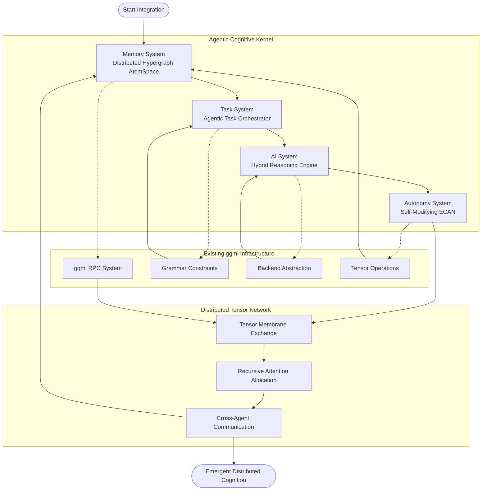
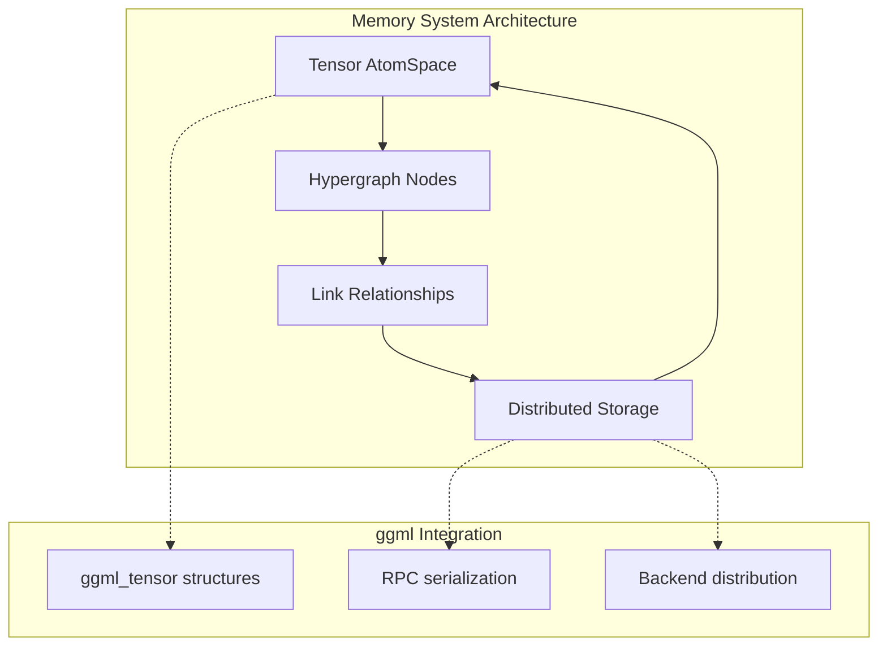
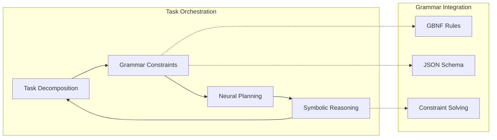
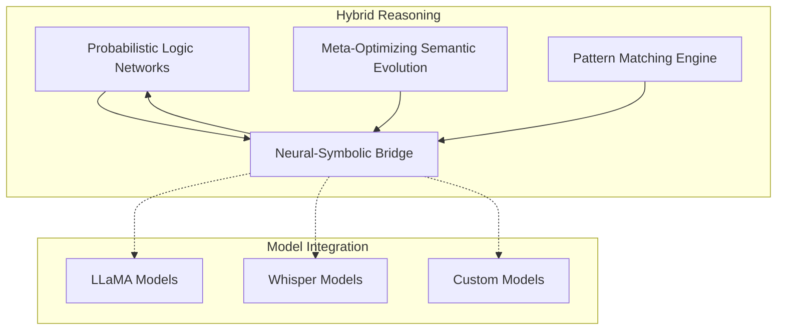
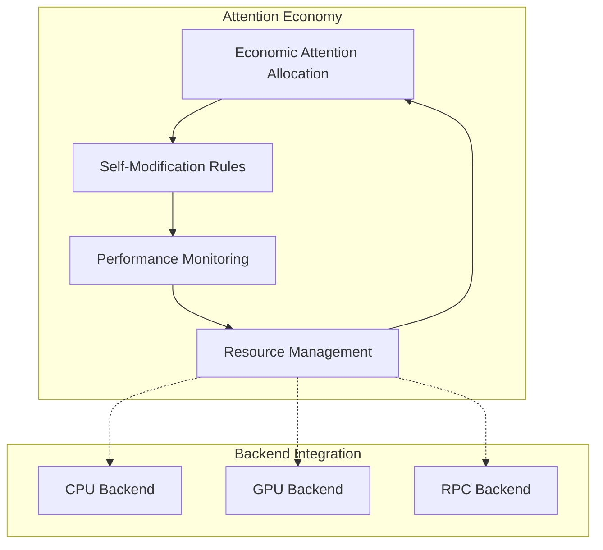
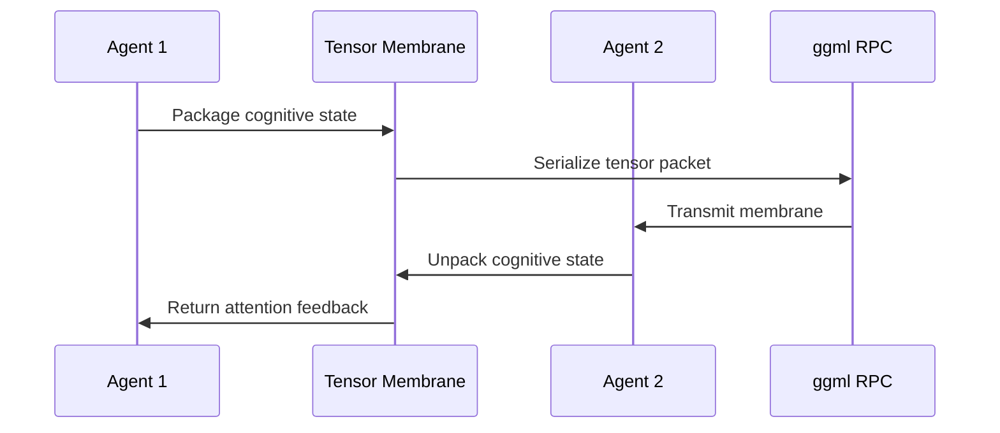
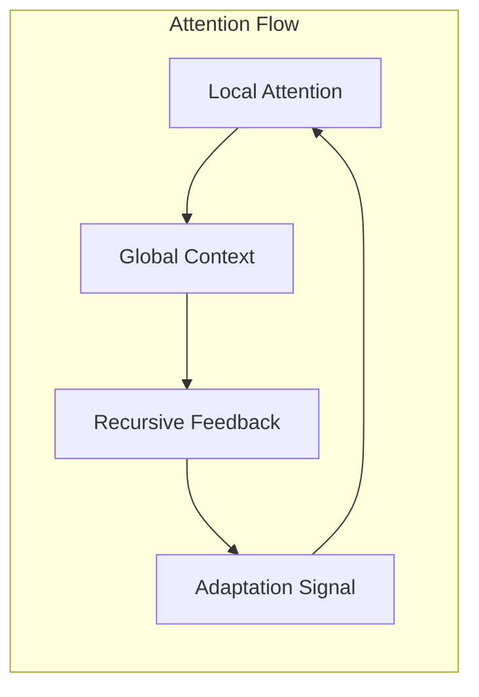

# Distributed Cognitive Architecture

## Overview

This document outlines the integration of the ggml-org-central repository as a distributed network of agentic cognitive grammar, fusing neural-symbolic integration with the practical capabilities of ggml. The system is designed as a recursive, self-aware cognitive flow that operates as both a technical architecture and a living diagram of emergent intelligence.

## Architecture Vision

The distributed cognitive system transforms traditional tensor computation into an ecosystem of autonomous agents, each operating as a kernel of cognitive grammar. These agents exchange tensor-shaped data structures to realize emergent intelligence through recursive coordination.

## System Architecture



## Subsystem Mapping

### 1. Memory System: Distributed Hypergraph AtomSpace (Tensorized)

**Existing Foundation**: ggml tensor operations, RPC serialization
**Enhancement**: Hypergraph knowledge representation



**Implementation**: 
- Each knowledge fragment encoded as ggml_tensor with metadata
- Hypergraph relationships stored in tensor dimension mappings
- Distributed across multiple ggml backends via RPC

### 2. Task System: Agentic Task Orchestrator (Recursive, Symbolic+Neural)

**Existing Foundation**: llama.cpp grammar system, ggml computation graphs
**Enhancement**: Recursive task decomposition



**Implementation**:
- Tasks represented as constrained generation problems
- GBNF grammars define valid task decompositions
- Computation graphs model task execution flows

### 3. AI System: Hybrid Reasoning Engine (PLN + MOSES + Pattern Matcher)

**Existing Foundation**: whisper.cpp/llama.cpp inference, ggml operations
**Enhancement**: Multi-modal reasoning integration



**Implementation**:
- PLN rules as tensor operations on belief values
- MOSES evolution using ggml optimization
- Pattern matching via tensor similarity operations

### 4. Autonomy System: Self-Modifying ECAN Attention Economy

**Existing Foundation**: ggml backend scheduling, optimization
**Enhancement**: Economic attention allocation



**Implementation**:
- Attention economy as resource allocation optimization
- Self-modification via dynamic graph rewriting
- Performance feedback through ggml profiling

## Distributed Communication Patterns

### Tensor Membrane Exchange



### Recursive Attention Flow



## Implementation Pathways

### Phase 1: Foundation Integration
1. **Catalog Kernel Primitives**
   - Map existing ggml operations to cognitive functions
   - Define tensor shapes for each cognitive kernel
   - Create hypergraph encoding scheme

2. **Enhance RPC Infrastructure**
   - Extend ggml-rpc with meta-cognitive headers
   - Add attention/salience routing
   - Implement cognitive state serialization

### Phase 2: Cognitive Grammar Implementation
3. **Grammar-Guided Reasoning**
   - Integrate GBNF with logical reasoning
   - Create cognitive grammar rule sets
   - Implement constraint-based planning

4. **Attention Economy Engine**
   - Develop ECAN-inspired scheduler
   - Implement utility-based resource allocation
   - Create novelty and goal salience metrics

### Phase 3: Self-Modification Capabilities
5. **Meta-Evolution System**
   - Implement MOSES-inspired optimization
   - Create self-modifying rule systems
   - Develop recursive improvement cycles

6. **Distributed Coordination**
   - Multi-agent consensus protocols
   - Emergent behavior monitoring
   - Global coherence maintenance

## Cognitive Kernel Definition

### Tensor Kernel Structure

```scheme
(define (cognitive-kernel name inputs outputs rules tensor-shape attention-weight)
  ;; Cognitive kernel definition
  (list 'kernel
        (cons 'name name)
        (cons 'inputs inputs)
        (cons 'outputs outputs)
        (cons 'rules rules)
        (cons 'tensor-shape tensor-shape)
        (cons 'attention-weight attention-weight)
        (cons 'meta-state (create-meta-state))))

(define (create-meta-state)
  ;; Meta-cognitive monitoring state
  (list 'meta-state
        (cons 'performance-history '())
        (cons 'adaptation-count 0)
        (cons 'interaction-log '())
        (cons 'goal-alignment 1.0)))
```

### Agent Communication Protocol

```c++
// Cognitive tensor packet structure
struct cognitive_tensor_packet {
    rpc_tensor base_tensor;          // Standard ggml tensor
    float attention_weight;          // Economic attention value
    uint32_t cognitive_type;         // Type of cognitive operation
    uint64_t source_agent_id;        // Originating agent
    uint64_t target_agent_id;        // Target agent
    char meta_context[256];          // Context information
    float salience_score;            // Relevance measure
    uint32_t recursion_depth;        // Self-reference depth
};
```

## Integration with Existing Components

### ggml RPC Enhancement

The existing ggml RPC system provides the foundation for distributed tensor operations. Enhancement involves:

1. **Cognitive Metadata**: Extend tensor packets with cognitive context
2. **Attention Routing**: Route tensors based on salience and relevance
3. **Meta-Monitoring**: Track cognitive operations across the network

### Grammar System Integration

The llama.cpp grammar system provides structured output constraints:

1. **Cognitive Grammars**: Define valid reasoning patterns
2. **Task Decomposition**: Use grammars to break down complex problems
3. **Validation**: Ensure cognitive outputs meet logical constraints

### Backend Abstraction

The ggml backend system enables distributed computation:

1. **Cognitive Backends**: Specialized backends for different reasoning types
2. **Load Balancing**: Distribute cognitive load based on agent capabilities
3. **Resource Management**: Allocate computational resources economically

## Emergent Properties

### Self-Organization
- Agents spontaneously form specialized roles
- Communication patterns adapt to task requirements
- Hierarchical structures emerge from flat networks

### Recursive Intelligence
- Agents model other agents' cognitive states
- Meta-reasoning about reasoning processes
- Self-improvement through recursive optimization

### Distributed Consciousness
- Global coherence from local interactions
- Shared attention and memory systems
- Collective problem-solving capabilities

## Validation and Testing

### Cognitive Benchmarks
1. **Attention Economy Efficiency**: Measure resource allocation optimality
2. **Emergent Behavior Detection**: Track spontaneous organization
3. **Recursive Depth Analysis**: Monitor self-reference stability
4. **Distributed Coherence**: Verify global state consistency

### Performance Metrics
1. **Cognitive Throughput**: Operations per second across the network
2. **Adaptation Speed**: Time to adjust to new conditions
3. **Memory Efficiency**: Hypergraph storage optimization
4. **Communication Overhead**: Network utilization analysis

## Future Extensions

### Advanced Cognitive Architectures
- Integration with formal logic systems
- Quantum-inspired reasoning patterns
- Biological neural network emulation

### Expanded Distributed Capabilities
- Cross-platform agent deployment
- Internet-scale cognitive networks
- Real-time collaborative reasoning

### Enhanced Self-Modification
- Genetic programming integration
- Automated architecture evolution
- Meta-meta-reasoning capabilities

---

This architecture represents a synthesis of cutting-edge AI research with practical implementation using the ggml ecosystem. It provides a roadmap for transforming distributed tensor computation into a truly cognitive, self-aware system capable of emergent intelligence and recursive self-improvement.